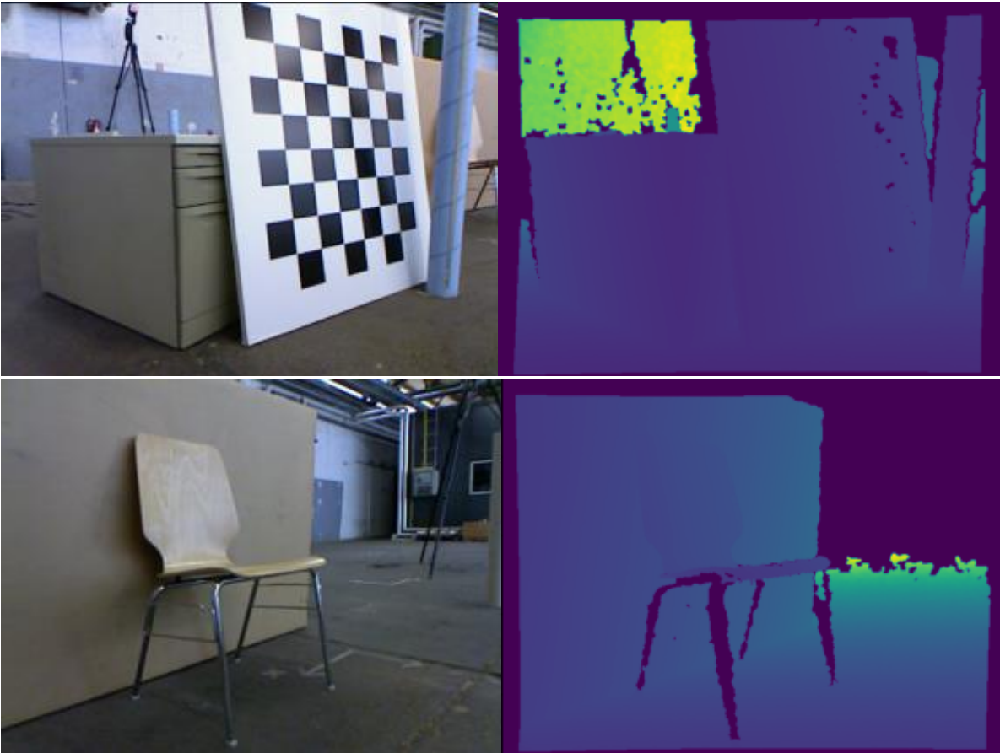
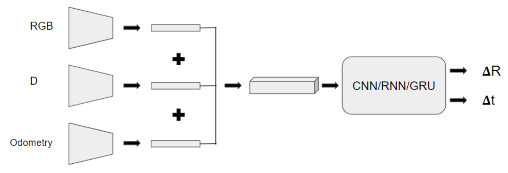

# 🐾 Making Spot® Your Travel Buddy

## 1. Introduction

### 1.1 Who’s Spot®, really?
Boston Dynamics’ Spot® is a bioinspired robotic marvel designed to operate in moderately complex environments alongside humans. Highly customizable, Spot® can be equipped with various sensors for tasks like:
- Digital twin creation
- Thermal imaging
- Tunnel surveying
- Leakage and crack detection

Despite its capabilities, one underexplored application is companionship — especially for the elderly and lonely. Spot® could emulate the loyalty and utility of a dog, performing tasks like fetching newspapers or answering doors.

### 1.2 The Problem
To serve as a true companion, Spot® must accompany its owner to diverse indoor environments — hotels, restaurants, homes — where localization is challenging due to:
- Absence of known landmarks
- Cluttered spaces
- No GPS availability
- Frequent environmental changes
- Limited training datasets

This project addresses these challenges by exploring indoor localization techniques.

---

## 2. Background

### 2.1 Early SLAM
Initial SLAM systems relied on feature-based pose tracking using 3D geometry and epipolar constraints. Optimization techniques like bundle adjustment reduced errors but were computationally intensive, limiting real-time performance.

### 2.2 Advanced SLAM
Modern SLAM uses LIDAR, GPS, and laser-based point clouds for fast outdoor navigation. Indoor mapping is feasible, but localization remains difficult. Notable advancements include:
- ORB-SLAM2 [1]
- KinectFusion [2]

---

## 3. 🔗 Project Repository
Access the full code [here](#/code).

---

## 4. Dataset

### 4.1 TUM Freiberg Dataset
This benchmark dataset includes:
- RGB-D and ground-truth trajectory data
- Microsoft Kinect sensor images (30 Hz, 640×480)
- High-accuracy motion capture (100 Hz)
- Accelerometer data

### 4.2 Visualization
Visual tools were used to analyze and interpret trajectory and depth predictions.

<figure>
    
    <figcaption>
    Figure 1: Collage showing sample images (left) and co-responding depth maps (right)
    </figcaption>
</figure>

---

## 5. Experiments & Key Implementations

Based on Droid-SLAM [3], the following modifications were made:
- Removed optical flow inputs
- Changed prediction from SE(3), depth pair to SO(3), displacement
- Simplified architecture for ease of use
- Replaced final estimation model with CNN, RNN, and GRU variants

---

## 6. Results & Significance

<figure>
    
    <figcaption>
    Figure 2: Suggested architecture
    </figcaption>
</figure>

<figure>
    
    <figcaption>
    Figure 3: Results with different types of estimation networks
    </figcaption>
</figure>

Key findings:
- ConvGRU (CNN + GRU) outperformed standard GRU
- Simple CNN produced cluttered, directionless outputs
- Residual networks improved clarity but struggled with sharp turns
- GRU captured temporal dependencies better
- Lack of optical flow input led to poor trajectory matching

---

## 7. Challenges Faced

### 7.1 Extent of Work
Solo effort with no teammates or existing research base. Despite this, substantial progress was made while managing three other non-research courses.

### 7.2 Industry Standards
Most professional SLAM implementations are in `C/C++`. `Python` is increasingly used for integrating machine learning with traditional methods.

---

## 8. Summary & Future Work

- Optical flow is crucial for accurate predictions
- SE(3) mapping offers more constraints than SO(3)
- Depth estimation could benefit from transformer-based models
- Exploring alternatives to optical flow may reduce computational load

---

## 📚 References

1. Mur-Artal, R. & Tardós, J.D. (2017). *ORB-SLAM2: An open-source SLAM system for monocular, stereo, and RGB-D cameras*. IEEE Transactions on Robotics, 33(5), 1255–1262.

2. Izadi, S. et al. (2011). *KinectFusion: Real-time 3D reconstruction and interaction using a moving depth camera*. ACM Symposium on User Interface Software and Technology, 559–568.

3. Teed, Z. & Deng, J. (2021). *Droid-SLAM: Deep visual SLAM for monocular, stereo, and RGB-D cameras*. NeurIPS, 34, 16558–16569.